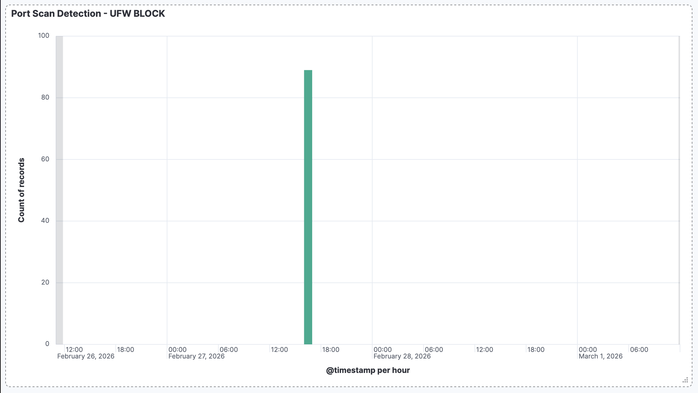

# Incident Analysis: Network Port Scan Detection

## Executive Summary
Detected and analyzed automated network reconnaissance activity targeting production infrastructure. Built SIEM detection rule to identify port scanning patterns in real-time using UFW firewall logs.

## Detection Method
Kibana dashboard with KQL query monitoring UFW firewall blocks for SYN packet patterns characteristic of port scanning activity.

## Timeline
- **13:41:53 UTC** - First port scan attempt detected
- **13:42:00 UTC** - Scan intensity peaked at 89 connection attempts
- **Attack duration:** ~2 minutes
- **Total blocked attempts:** 89 across ports 1-1000

## Analysis

### Attack Pattern
- **Source IP:** 192.168.1.135 (internal network)
- **Target:** 192.168.1.134 (Ubuntu Server)
- **Method:** SYN scan (TCP half-open scan)
- **Ports targeted:** Sequential scan of ports 1-1000
- **Tool signature:** nmap default scan pattern

### MITRE ATT&CK Mapping
- **Technique:** T1046 - Network Service Discovery
- **Tactic:** Discovery
- **Description:** Adversary scanning network to identify open ports and running services

### Technical Indicators
**UFW Log Sample:**
```
[UFW BLOCK] IN=enp0s1 OUT= SRC=192.168.1.135 DST=192.168.1.134 
PROTO=TCP SPT=64584 DPT=5601 WINDOW=65535 RES=0x00 SYN URGP=0
```

**Key Indicators:**
- SYN flag set, ACK flag not set = half-open scan
- Sequential destination ports
- Rapid connection attempts from single source
- No application-layer data

## Detection Rule

### KQL Query
```
message: *UFW* AND message: *SYN*
```

### Dashboard Configuration
- **Visualization:** Bar chart
- **Time interval:** Per hour
- **Metric:** Count of UFW BLOCK events
- **Filter:** SYN packets only

### Alert Threshold
Trigger when >10 blocked SYN packets from single source IP within 1 minute.

## Response Actions

### Immediate Actions Taken
1. Verified no successful port connections
2. Confirmed source IP as authorized security testing (lab environment)
3. Documented attack pattern for detection improvement

### Production Response (Recommended)
1. **Isolate source IP** - Block at perimeter firewall
2. **Investigate source system** - Check for compromise indicators
3. **Review authentication logs** - Verify no successful logins from source
4. **Escalate to IR team** - If source is external or unauthorized

### Containment Measures
- UFW firewall successfully blocked all connection attempts
- No ports were successfully enumerated by attacker
- No lateral movement possible due to firewall blocking

## Lessons Learned

### What Worked
- UFW firewall logging captured all scan attempts
- SIEM pipeline (journald → Filebeat → Elasticsearch) provided real-time visibility
- KQL detection query successfully identified SYN scan pattern
- Dashboard visualization made attack immediately visible to analysts

### Detection Improvements
- Add automated alerting when threshold exceeded
- Correlate with authentication logs to detect follow-on attacks
- Implement IP reputation checking for external sources
- Create runbook for port scan response workflow

## Technical Implementation

### Lab Architecture
```
Attack Source (Mac) → Port Scan → Ubuntu Server (Target)
                                        ↓
                                    UFW Firewall
                                        ↓
                                   journald logs
                                        ↓
                              ufw-log-forwarder service
                                        ↓
                                 /var/log/custom/ufw.log
                                        ↓
                                     Filebeat
                                        ↓
                                  Elasticsearch
                                        ↓
                                  Kibana Dashboard
```

### Detection Pipeline Components

**1. UFW Firewall Logging**
```bash
sudo ufw enable
sudo ufw logging on
```

**2. Log Forwarding Service**
```bash
# /etc/systemd/system/ufw-log-forwarder.service
[Service]
ExecStart=/bin/sh -c 'journalctl -k -f | grep --line-buffered UFW >> /var/log/custom/ufw.log'
```

**3. Filebeat Configuration**
```yaml
filebeat.inputs:
- type: filestream
  id: ufw-logs
  enabled: true
  paths:
    - /var/log/custom/ufw.log

output.elasticsearch:
  hosts: ["https://localhost:9200"]
  username: "elastic"
  password: "${ELASTIC_PASSWORD}"
```

## Evidence

### Dashboard Screenshot


### Attack Timeline
- 89 blocked connection attempts in 2-minute window
- Clear spike visible in Kibana visualization
- All attempts blocked by UFW firewall

## Recommendations

1. **Enable automated alerting** - Configure Kibana to send alerts when scan detected
2. **Implement rate limiting** - Add fail2ban rules to auto-block scanning IPs
3. **Enhance logging** - Add GeoIP enrichment for source location identification
4. **Create playbook** - Document standard response procedures for port scan incidents
5. **Regular testing** - Schedule quarterly port scan simulations to verify detection

---

**Analyst:** Chris Bontas
**Date:** February 27, 2026  
**Environment:** SOC Home Lab  
**Tools Used:** UFW, Filebeat, Elasticsearch, Kibana, nmap
